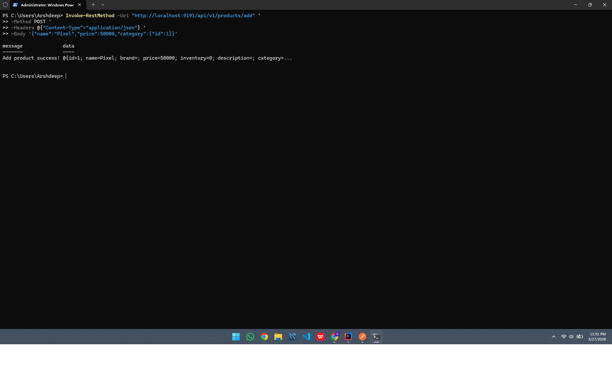
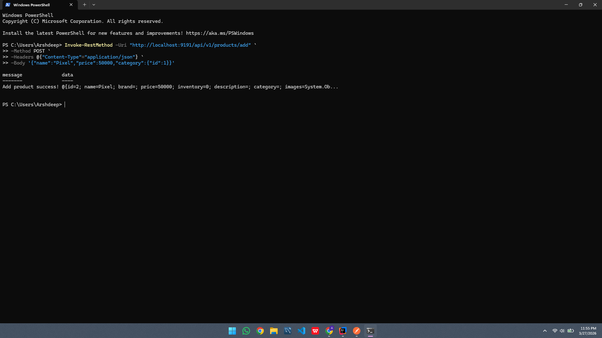
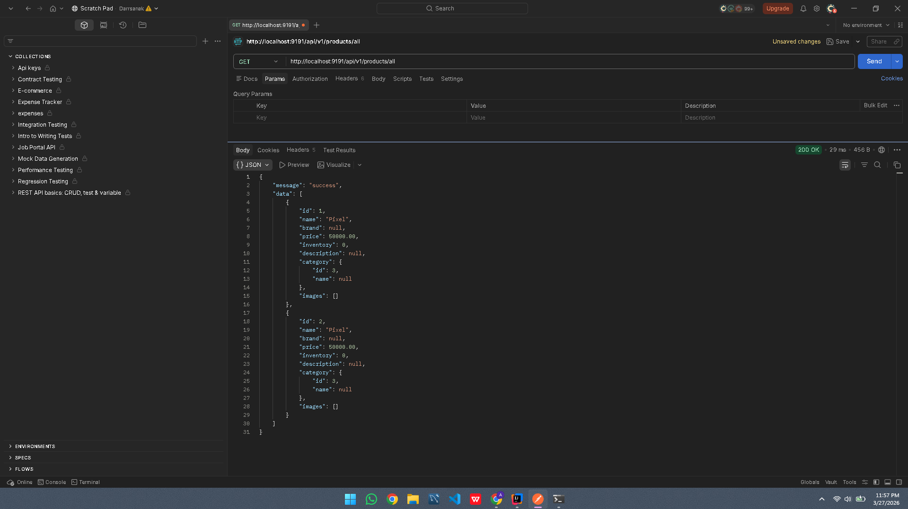

##Dream shops - Spring boot E-Commerce backend

A RESTful backend application for an e-commerce system built using Spring Boot, MySQL, and JPA/Hibernate.
This project demonstrates core backend engineering concepts such as API design, layered architecture, and database relationships.


Tech Stack:-

Java 17 ,Spring Boot, Spring Data JPA (Hibernate), MySQL, Maven

```
Project Structure

src/main/java/com/dailycodework/dreamshops
│
├── controller     # Handles HTTP requests (API layer)
├── service        # Business logic
├── repository     # Database access (JPA)
├── model/entity   # Database entities
└── DreamShopsApplication.java  # Entry point
```
#Setup Instructions :-

1. Clone the repository
```
git clone https://github.com/dailycodework/dream-shops.git
cd dream-shops
```


2. Configure Database
```
Create a MySQL database:

CREATE DATABASE dream_shops;

Update `application.properties`:

spring.datasource.url=jdbc:mysql://localhost:3306/dream_shops
spring.datasource.username=root
spring.datasource.password=YOUR_PASSWORD #Put your DB password here!!

spring.jpa.hibernate.ddl-auto=update
spring.jpa.show-sql=true

```
3. Run the Application
```
Using IntelliJ or terminal:

mvn spring-boot:run

Application will start on:

http://localhost:9191
```


#API Endpoints:-
```
##Products:-

| Method | Endpoint               |
| ------ | ---------------------- |
| GET    | `/api/v1/products/all` |
| POST   | `/api/v1/products/add` |


##Categories

| Method | Endpoint             |
| ------ | -------------------- |
| POST   |`/api/v1/categories/add`|

```

##Key Concepts Demonstrated

* REST API design
* Layered architecture (Controller → Service → Repository)
* Entity relationships (Product ↔ Category, Order ↔ User)
* Database integration with JPA/Hibernate
* JSON request/response handling


##Features

* Product and Category management
* Relational database mapping
* Clean and modular backend structure
* Auto table creation using Hibernate


#Notes

##Built as a hands-on backend project to understand how real-world e-commerce systems handle product management, database relationships, and API design.
##APIs tested using Postman
##Backend connected with MySQL database

#API Demo

Below are sample API interactions demonstrating the working backend.

##Create Product (POST)

Adds a new product linked to an existing category.




##Create Product (POST)

Another successful product creation request.




##Get All Products (GET)

Fetches all stored products from the database.




#Author:-
**Arshdeep Nayan**
Developed as a backend learning project to demonstrate real-world Spring Boot application structure.
